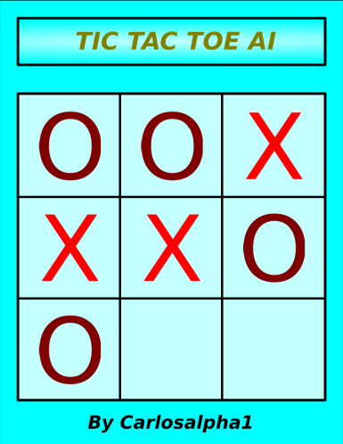

# TIC-TAC-TOE-AI
Welcome to a classic **Tic Tac Toe** controled by Artificial Intelligence (AI).

The game is programmed using the *Alpha Beta Pruning* algorithm (derived from the *MiniMax* algorithm used in Game Theory).

 

    

 

**Warning**: AI plays better than you ;)

## How to run
If you have not installed SFML:
~~~
sudo apt-get install libsfml-dev
~~~

Then:
~~~
make
./tictactoe [2]
~~~
**Optional Argument**: Number **2** -> The AI starts the game.

## References

* (Spanish version): Inteligencia Artificial: Un enfoque moderno. 2da edición. Peter Norvig y Stuart J. Russel. Capítulo 6: Búsqueda entre adversarios
